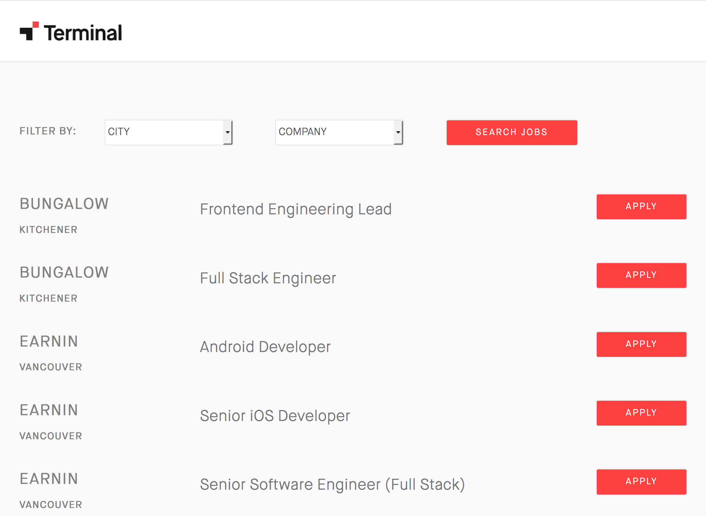

## Frontend Interview Exercise for Terminal

Using the stack of your choice, re-create the [terminal.io job listings page](https://terminal.secure.force.com/?page=TerminalJobOpenings&JobSite=default&p=Candidate) with the dataset in [jobs.json](./jobs.json).

The logo and font can be found under [assets](./assets).

> Using Template Literal added the json data to HTML
> Working on Filter Should be updated soon.